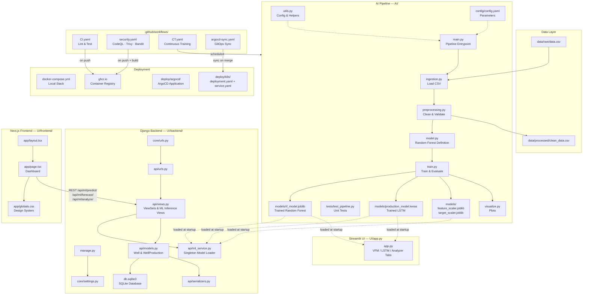

# Oil Well Production Prediction

An enterprise-grade MLOps platform for predicting oil well production rates using Random Forest regression and LSTM deep learning. The project spans a complete data pipeline, a Django REST API backend, a Next.js dashboard, security-focused CI/CD automation, and Kubernetes deployment.

---

## Architecture Overview



---

## Project Structure

```
oil-well-production-prediction/
|
+-- AI/                                 # ML training pipeline
|   +-- main.py                         # Pipeline entrypoint
|   +-- config/
|   |   +-- config.yaml                 # Runtime parameters (paths, hyperparams)
|   +-- src/
|   |   +-- ingestion.py                # CSV data loader
|   |   +-- preprocessing.py            # Data cleaning and validation
|   |   +-- model.py                    # Random Forest model definition
|   |   +-- train.py                    # Training and evaluation loop
|   |   +-- visualize.py                # Plot generation (actual vs predicted)
|   |   +-- utils.py                    # Config loader and shared helpers
|   +-- models/
|   |   +-- rf_model.joblib             # Trained Random Forest artifact
|   |   +-- feature_scaler.joblib       # Input scaler for LSTM
|   |   +-- target_scaler.joblib        # Output scaler for LSTM
|   |   +-- production_model.keras      # Trained LSTM artifact
|   +-- tests/
|       +-- test_pipeline.py            # Pytest unit tests
|
+-- UI/                                 # Full-stack web application
|   +-- app.py                          # Streamlit legacy dashboard
|   |
|   +-- backend/                        # Django REST API
|   |   +-- manage.py
|   |   +-- core/
|   |   |   +-- settings.py             # Django settings
|   |   |   +-- urls.py                 # Root URL configuration
|   |   +-- api/
|   |       +-- models.py               # Well and WellProduction database models
|   |       +-- serializers.py          # DRF serializers
|   |       +-- views.py                # CRUD ViewSets and ML inference views
|   |       +-- urls.py                 # API routing
|   |       +-- ml_service.py           # Singleton ML model loader
|   |
|   +-- frontend/                       # Next.js 16 / React 19
|       +-- app/
|       |   +-- page.tsx                # Main dashboard (VFM, LSTM, RCA tabs)
|       |   +-- globals.css             # Vanilla CSS design system
|       +-- public/                     # Static assets
|
+-- .github/workflows/
|   +-- CI.yaml                         # Lint and test on every push
|   +-- security.yaml                   # CodeQL, Trivy, Bandit, Semgrep, pip-audit
|   +-- CT.yaml                         # Scheduled model retraining
|   +-- argocd-sync.yaml                # GitOps reconciliation trigger
|
+-- deploy/
|   +-- k8s/
|   |   +-- deployment.yaml             # Kubernetes Deployment
|   |   +-- service.yaml                # Kubernetes Service
|   +-- argocd/                         # ArgoCD Application definition
|
+-- docs/                               # Docker registry documentation
+-- data/raw/data.csv                   # Source production dataset
+-- docker-compose.yml                  # Local multi-service stack
+-- requirements.txt                    # Python dependencies
```

---

## Quick Start

### Prerequisites

- Python 3.11+
- Node.js 20+
- Git
- Docker (optional)

### 1. Clone and install

```bash
git clone https://github.com/abdelkderboukert/oil-well-production-prediction.git
cd oil-well-production-prediction

python -m venv virt
source virt/bin/activate        # Windows: virt\Scripts\activate
pip install -r requirements.txt
```

### 2. Train the models

```bash
python AI/main.py
```

Outputs: `AI/models/rf_model.joblib`, `production_model.keras`, scalers, plots, and `reports/model_metrics.json`.

### 3. Start the backend API

```bash
cd UI/backend
python manage.py migrate
python manage.py runserver      # http://localhost:8000
```

### 4. Start the frontend

```bash
cd UI/frontend
npm install
npm run dev                     # http://localhost:3000
```

### 5. Full stack with Docker Compose

```bash
docker-compose up --build
```

| Service | URL |
|---|---|
| Next.js Frontend | http://localhost:3000 |
| Django API | http://localhost:8000/api/ |

---

## API Reference

| Method | Endpoint | Description |
|---|---|---|
| `GET` / `POST` | `/api/wells/` | List or create wells |
| `GET` / `POST` | `/api/production/` | List or create production records |
| `POST` | `/api/ml/predict/` | Random Forest multi-output prediction |
| `POST` | `/api/ml/forecast/` | LSTM 7-day forecast for a given well |
| `POST` | `/api/ml/analyze/` | Upload daily report, returns anomalies and RCA |
| `GET` | `/api/export/?well=<name>` | Export well data as CSV |
| `POST` | `/api/import/` | Bulk import CSV or Excel to database |

---

## Configuration

Edit `AI/config/config.yaml` to customise pipeline behaviour:

```yaml
data:
  raw_path: "data/raw/data.csv"
  processed_path: "data/processed/clean_data.csv"

pipeline:
  target_col: "W_GAS"
  feature_cols: ["HOURS", "WHP", "WHT", "WLP", "H2O", "WATER"]

model:
  test_size: 0.2
  random_state: 42
  n_estimators: 50
```

---

## Evaluation Metrics

| Metric | Description |
|---|---|
| R² Score | Proportion of variance explained |
| MAE | Mean Absolute Error |
| MSE | Mean Squared Error |
| RMSE | Root Mean Squared Error |

Results are written to `reports/model_metrics.json` after each training run.

---

## CI/CD Workflows

The following diagram describes the end-to-end MLOps pipeline, from code push through security scanning, model training, image build, and GitOps deployment.



| Workflow | File | Trigger | Purpose |
|---|---|---|---|
| Build & Test | `CI.yaml` | Push / PR | Lint, unit tests, build validation |
| Security Scan | `security.yaml` | Push / PR | Static analysis, CVE scan, secret detection, image push |
| Continuous Training | `CT.yaml` | Scheduled | Retrain models on updated data |
| ArgoCD Sync | `argocd-sync.yaml` | Push to main | Trigger GitOps reconciliation to Kubernetes |

---

## Security Scanning

Automated scans run on every push via `.github/workflows/security.yaml`:

| Tool | Purpose |
|---|---|
| CodeQL | Semantic code analysis |
| Semgrep | Pattern-based vulnerability detection |
| Trivy | Container image CVE scanning |
| Bandit | Python-specific security checks |
| TruffleHog | Secret and credential leak detection |
| pip-audit | Python dependency vulnerability checks |

See [SECURITY.md](SECURITY.md) for the reporting policy.

---

## Testing

```bash
# AI pipeline unit tests
cd AI && pytest tests/ -v --cov=src

# Django backend tests
cd UI/backend && pytest api/tests.py -v
```

---

## Container Registry

Docker images are built and pushed to GitHub Container Registry on every push to `main` and `development`.

```bash
docker pull ghcr.io/abdelkderboukert/oil-well-production-prediction:main

docker run --rm \
  -v $(pwd)/data:/app/data \
  -v $(pwd)/AI/models:/app/models \
  ghcr.io/abdelkderboukert/oil-well-production-prediction:main
```

**Tags:** `main`, `development`, `sha-<7-digit>`, `v1.0.0` (on release)  
**Architectures:** `linux/amd64`, `linux/arm64`

---

## Kubernetes Deployment

```bash
kubectl apply -f deploy/k8s/
```

ArgoCD GitOps sync is managed via `.github/workflows/argocd-sync.yaml` and `deploy/argocd/`.

---

## Contributing

See [CONTRIBUTING.md](CONTRIBUTING.md) for contribution guidelines and code standards.

---

## Contact

- Email: [abdelkaderboukart@gmail.com](mailto:abdelkaderboukart@gmail.com)
- Issues: [GitHub Issues](https://github.com/abdelkderboukert/oil-well-production-prediction/issues)
- Documentation: [docs/](docs/)

---

Last updated: April 16, 2026
